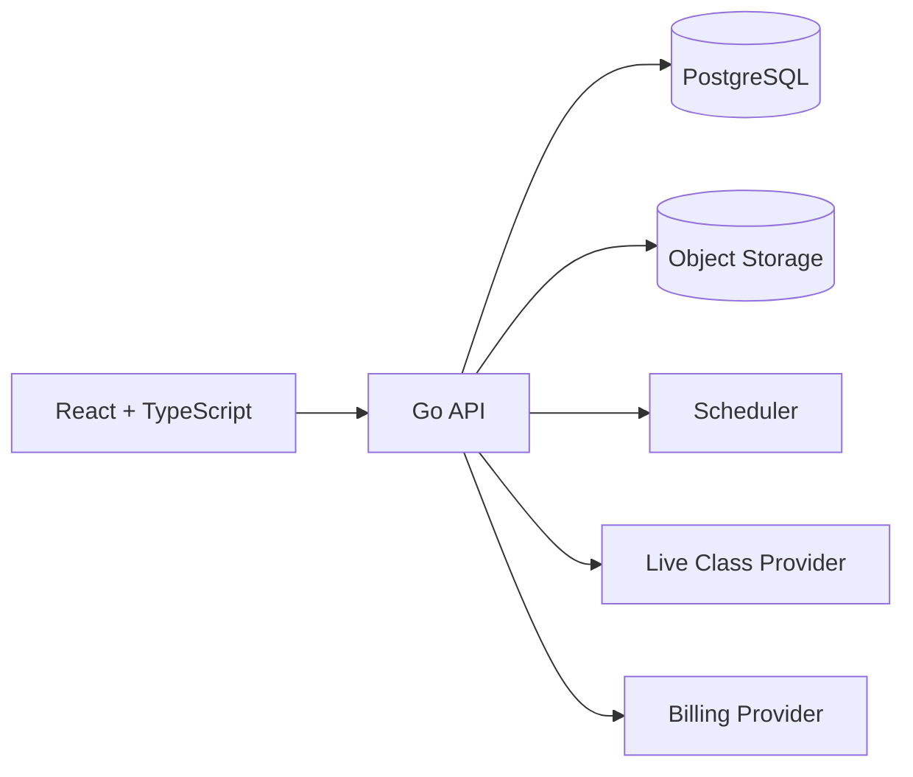
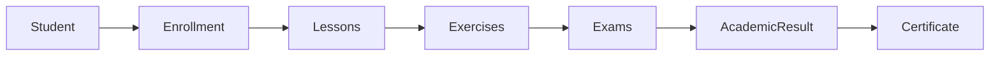

# FluentHub


Full-stack language school management and learning platform built with Go, React and TypeScript.

> **Current status: Experimental.** FluentHub 0.1.0 is an architectural implementation and product foundation. Automated tests, builds, migrations and runtime validation have intentionally not been executed in this version.

## Overview

FluentHub is a complete language school management and learning platform. It combines school administration, teaching, formal assessment, student service, operational billing and certification in one modular monolith. The initial experience is language-agnostic even though the example catalog focuses on English.

## Product Vision

Language schools should not need disconnected spreadsheets, meeting links, gradebooks, billing tools and support inboxes to operate. FluentHub gives administrators, teachers, students and operators a coherent workspace with one authorization model and one auditable source of truth.

## Problem

Most small and midsize language schools assemble their workflow from unrelated tools. Data becomes duplicated, attendance is unreliable, exercise and exam rules get blurred, grade changes lose context, and students cannot see a unified learning journey.

## Solution

FluentHub models the entire academic lifecycle—from enrollment through lessons, practice, exams, academic closure and certificate issuance—while keeping operational billing and support next to the learning experience.

## Key Features

- Live Classroom through a provider abstraction, without implementing a WebRTC server.
- Recorded Lessons with protected object-storage keys and independent replay tracking.
- Heartbeat-based Attendance with recoverable presence segments.
- Separate Exercise Engine and Separate Exam Engine with independent lifecycle rules.
- Speaking Assessments, audio submissions, configurable rubrics and manual feedback.
- Listening Activities with protected media.
- Hybrid Automatic/Manual Grading without exposing correct answers.
- Grade Revision Audit requiring reasons after publication.
- Global Academic Policy using basis points and scaled scores.
- Language Skills Tracking for school-configurable learning categories.
- Operator Workspace for enrollment, billing, notification and support workflows.
- Integrated Support Center with requester/opened-by separation and internal notes.
- Billing Provider Abstraction with clearly fictitious demonstration invoice data.
- Verifiable Certificates with revocation-aware public lookup.
- White-label School Branding using runtime CSS variables.

## Architecture

FluentHub is a modular monolith: one Go API, one React application and one PostgreSQL source of truth. Module boundaries preserve future options without the cost of premature microservices.





Private endpoints live below `/api/v1`. PostgreSQL owns durable state; local storage is the first `ObjectStorage` adapter; the scheduler uses a bounded tick loop; SSE events are distributed across API replicas through PostgreSQL `LISTEN/NOTIFY`.

## Technology Stack

| Layer | Technology |
| --- | --- |
| Backend | Go, `net/http`, pgx, slog, explicit dependency injection |
| Frontend | React, TypeScript, Vite, React Router, Tailwind CSS, Lucide icons |
| Database | PostgreSQL with versioned SQL migrations |
| Files | Local filesystem behind `ObjectStorage` |
| Realtime | Server-Sent Events |
| Deployment | Multi-stage Docker images and Compose |

## User Roles

- **Administrator:** school structure, identity, access, academic policy, oversight, audit and certificates.
- **Teacher:** assigned classes, lessons, live sessions, attendance, exercises, exams and grading.
- **Student:** classes, recordings, activities, exams, grades, performance, support, billing and certificates.
- **Operator:** administrative student service, authorized enrollment, billing, notifications and assigned support.

RBAC uses `Role`, `Permission`, `RolePermission` and `UserRole`; additional coordinator, financial, support and read-only roles can be created later. Backend authorization remains authoritative.

## Administrator Area

The admin navigation covers units, courses, classes, enrollments, users by role, academic policy, billing, support, certificates, branding, audit and settings. Historical records are archived or disabled. Implementations must prevent accidental loss of the final privileged administrator.

## Teacher Area

Teachers see their day, assigned classes, lessons, live-class actions, exercise and exam authoring, separate grading queues, attendance and scoped student performance. Ordinary teachers cannot modify the global academic policy or perform academic overrides.

## Student Area

The mobile-first student workspace highlights the next class, pending work, published grades, attendance and learning-skill aggregates. Live entry, recordings, exercises, exams, support and certificate access are represented as dedicated routes.

## Operator Area

Operators register students, manage permitted enrollment data, issue mock-provider charges, send notifications and work assigned tickets. A ticket records both the requester and the user who opened it. Operators do not edit academic grades by default.

## School Units

`Unit` supports physical campuses and online operations, with independent contact data, timezone and lifecycle. Classes belong to a unit.

## Courses and Levels

`Course`, `CourseLevel` and `CourseModule` model a flexible catalog. CEFR labels can be used but are not mandatory; schools may define their own level structure and language-skill catalog.

## Classes and Enrollments

`ClassGroup` has planned, open, active, completed, cancelled and archived states. `Enrollment` has a unique student/class pair and preserves academic closure, result and certificate references.

## Live Classes

`LiveClassProvider` defines session creation, lifecycle, role-specific join information and recording controls. The LiveKit adapter creates and deletes rooms through its Twirp API, issues 15-minute role-scoped JWTs and controls Egress recording. The React classroom connects with `livekit-client`; API secrets never reach the browser. `MockProvider` remains available for demonstrations.

## Class Recordings

Published `LessonRecording` entries point to opaque storage keys. `RecordingView` measures content consumption without modifying live attendance. Browser-native HTML media is the intended first player; DRM is outside scope.

## Smart Attendance

Joining creates or resumes an attendance session. A 30-second frontend heartbeat refreshes the active presence segment. The backend aggregates non-overlapping segments, caps time to lesson duration and classifies attendance with the school policy. Missing `LEAVE` events are recovered from stale heartbeat timestamps.

## Exercises

Exercises are flexible practice activities with independent availability, deadlines and attempt limits. Question types include multiple choice, true/false, short text, long text, fill blank, listening, speaking and optional matching. Objective questions can be graded server-side; writing and speaking remain manual unless an explicit future rule is introduced.

## Speaking Exercises

Speaking responses use `AudioSubmission` and object storage. The teacher can replay audio, apply configured `GradingCriterion` rubrics and publish feedback. Criteria are data, not hardcoded to a fixed list.

## Listening Exercises

Listening questions reference protected audio objects. The initial model supports basic playback and answer capture without DRM or complex playback limits.

## Exam Engine

Exams contain sections, time windows, server-computed expiration, incremental answer saves, attempt limits and controlled result publication. The server refuses late changes after a documented 15-second transport tolerance and never relies on the browser timer.

## Exercise vs Exam Design

Exercise and Exam are separate domains. They can share safe internal helpers, but lifecycle, attempts, answers, grades and database tables remain distinct. This prevents practice-oriented changes from silently weakening formal assessment rules.

## Grading

Objective and manual components are stored separately. Scores use integers scaled by 100 (`8.50 → 850`); this strategy is consistent across assessments and academic results. Published grade changes create `GradeRevision` plus an audit event and require a reason.

## Grade Revision History

Grades are never silently overwritten after publication. Revisions retain previous score, new score, actor, reason and timestamp. The audit log stores metadata but not complete exam responses or uploaded content.

## Academic Policy

Each school has one global `AcademicPolicy`: minimum passing score, exercise/exam weights, minimum attendance and mandatory-work requirements. Weights use basis points and must total 10,000.

## Approval and Failure Rules

The academic calculator applies weighted exercise and exam averages, then checks the passing threshold, attendance and mandatory completion. Results move through `in_progress`, `pending_review`, `approved` or `failed`. An override requires `academic.override`, a reason, an `AcademicOverride` record and audit event.

## Language Skill Tracking

Questions may link to school-configurable skills such as reading, writing, listening, speaking, grammar and vocabulary. Student graphs are transparent aggregates of categorized school activities; they are not scientific diagnoses or predictions.

## Billing

Invoices store `amountCents` as `int64`, never floating-point currency. Draft, issued, paid, overdue and cancelled states preserve operational history; payments are separate records.

## Billing Provider Abstraction

`BillingProvider` exposes customer provisioning plus create, fetch and cancel operations. The Asaas adapter supports sandbox or production endpoints, BOLETO issuance, identification-field retrieval and cancellation while keeping money in integer cents. Authenticated webhooks are deduplicated by event ID and update invoices/payments transactionally. A bounded scheduler reconciles provider state at startup and every configured interval, preserving run statistics and never regressing terminal states because of delayed events. `MockBillingProvider` remains available and visibly non-payable.

## Notifications

The in-app notification center supports read/read-all flows and events for lessons, assessment, billing, support and certificates. SSE delivers lightweight updates. Email is reserved as `email_future`.

## Support Center

Tickets have category, priority, state, requester, opener and current assignee. Assignment history prevents ambiguity. Internal messages are only visible to authorized staff. PNG, JPEG, WEBP, PDF and optional TXT attachments use authorized object storage.

## Certificates

Approved, completed enrollments can receive branded PDF certificates. The renderer supports classic and modern layouts, validated colors, school identity, student/course/level, workload, completion date, optional score, number and a QR verification code. Generated PDFs use opaque object-storage keys.

## Certificate Verification

`GET /api/v1/public/certificates/verify/:code` returns only certificate status, student display name, course, level, completion date, workload and certificate number. Revoked certificates remain historically visible as revoked. Email, phone, address and identity documents are never returned.

## School Branding

Branding covers system title, school display name, light/dark logos, favicon, login image, primary/secondary/accent colors, welcome text and certificate identity. The frontend applies `--brand-primary`, `--brand-secondary` and `--brand-accent` at runtime, with safe fallbacks.

## Security Model

Passwords use bcrypt and are never returned or logged. Sessions use random tokens whose SHA-256 digests are stored server-side, with HttpOnly, SameSite cookies and production `Secure`. Disabled users lose access and password changes revoke active sessions. Backend RBAC and school/class/enrollment scope must guard every sensitive operation. Correct answer flags remain server-side. Storage rejects traversal and oversized writes. Audit metadata excludes passwords, tokens, authorization headers, complete answers and file contents.

The architecture includes privacy-oriented controls, but legal compliance depends on deployment, configuration and organizational processes.

## Data Model

The migrations cover identity, academic structure, lessons/live learning, separate assessment engines, academic closure, billing, notification, support, certification and audit. See [domain model](docs/domain-model.md) and [database design](docs/database.md).

## Getting Started

Prerequisites: Go 1.24+, Node.js 22+, PostgreSQL 17+ and a migration runner compatible with ordered SQL files.

1. Copy `.env.example` to `.env` and replace secrets.
2. Create the PostgreSQL database.
3. Apply `backend/migrations/*.up.sql` in numeric order.
4. From `backend`, run `go run ./cmd/api`.
5. From `frontend`, install dependencies and run `npm run dev`.
6. Open `/setup` to atomically create the school, branding, first administrator, first unit, system roles, initial skills and academic policies.

The backend build and local provider/storage contract validator have been executed. Full application runtime still requires PostgreSQL and provider credentials.

## Configuration

`.env.example` documents environment, ports, PostgreSQL URL, origins, provider credentials, AES storage key, ClamAV address, backup interval and retention. Never commit `.env`. Production configuration refuses plaintext storage or disabled malware scanning.

## API

Private routes are under `/api/v1`; public branding and certificate verification are deliberately narrow. Errors use:

```json
{"error":{"code":"VALIDATION_ERROR","message":"Invalid request body","requestId":"f82c..."}}
```

See [API documentation](docs/api.md).

## Object Storage

`ObjectStorage` exposes `Put`, `Open`, `Delete`, `Exists` and `Close`. Uploads are quarantined, size-limited, streamed to ClamAV, then encrypted in authenticated AES-256-GCM chunks before receiving an opaque local key. Scheduled `tar.gz` snapshots contain encrypted objects, receive SHA-256 sidecars and follow configured retention. Database backup and off-site replication remain deployment responsibilities. See [storage security](docs/storage-security.md).

## Docker

`compose.yml` defines PostgreSQL, backend, frontend and ClamAV, plus isolated database, encrypted object-storage, backup and signature-database volumes. Images use multi-stage builds; the backend runtime uses a non-root account.

## Project Structure

```text
backend/   Go API, domain modules, providers, scheduler, storage and migrations
frontend/  React workspaces, routes, shared components and dynamic branding
docs/      Architecture, domain, security, operational guides and ADRs
```

## Design Decisions

Thirteen ADRs document the main architectural choices: Go, React/TypeScript, modular monolith, PostgreSQL, assessment separation, provider abstractions, heartbeat attendance, object storage, academic policy, grade history, public verification and white-label branding.

## Limitations

- Experimental foundation; no claim of production readiness.
- Focused automated Asaas webhook/provider tests exist and pass locally; broader domain coverage and CI remain future work.
- LiveKit and Asaas adapters were validated against local contract servers, not external accounts, because credentials were not present.
- The PostgreSQL integration test requires `FLUENTHUB_TEST_DATABASE_URL`; it is skipped when an isolated test database is unavailable.
- Storage snapshots cover object files, not PostgreSQL; off-site replication, key custody/rotation and restore drills are operational responsibilities.
- The certificate layout was rendered and visually approved with fictitious data; each school's uploaded logo and unusually long names still require acceptance review.
- A frontend dependency lockfile could not be generated because Node/npm was unavailable in the authoring environment; dependency versions are exact in `package.json`.
- Legal/privacy compliance is deployment- and organization-specific.

## Roadmap

### v0.2

- automated tests and GitHub Actions CI
- email notifications
- broader automated test coverage and provider retry controls
- richer attendance reports, CSV student import and PDF academic reports
- improved certificate templates and document preview

### v0.3

- mobile PWA improvements and push notifications
- Google/Microsoft calendar integration
- parent/guardian portal, teacher scheduling and room management
- waiting lists, prerequisites and student transfer

### v0.4

- AI-assisted language feedback, pronunciation analysis and transcription
- AI writing feedback, adaptive exercise suggestions and semantic lesson search

### v0.5

- multi-school SaaS mode, tenant billing and advanced analytics
- SSO and enterprise integrations

## Contributing

Open an issue before large changes. Keep domains explicit, preserve school isolation, document new authorization rules and accompany future behavior changes with tests once the v0.2 test foundation exists.

## License

MIT License. Copyright © 2026 Thiago Montozo.
