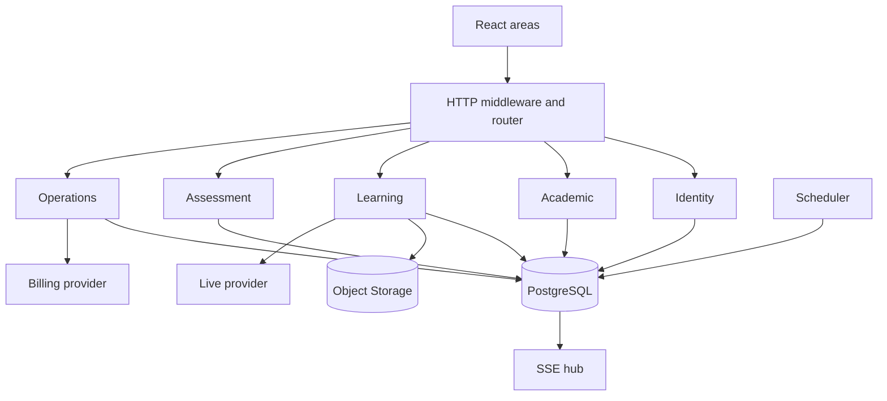

# Architecture

## Modular monolith

FluentHub deploys as one Go API and one React application. Domain packages own their vocabulary and rules while PostgreSQL transactions coordinate cross-domain workflows. This avoids network-bound distributed transactions and preserves a path to extraction if scale evidence justifies it.

The backend composition root is `cmd/api/main.go`. It loads configuration, opens pgx, creates providers, injects stores/services into the HTTP router, starts the bounded scheduler and coordinates shutdown. Interfaces are defined by consumers and remain small.

## Backend modules

Identity covers schools, branding, users, sessions, roles and permissions. Academic structure covers units, courses, levels, modules, classes and enrollments. Learning covers lessons, live sessions, recordings and attendance. Assessment deliberately has separate exercise and exam packages. Operations covers billing, notification, support and audit. Certification depends on a closed approved academic result.

Handlers decode bounded input and produce standardized errors. Durable SQL belongs to domain stores/services rather than presentation code. Every query operating on tenant data must include school scope; teacher and student paths add class/enrollment scope.

## Frontend areas

React Router separates administrator, teacher, student and operator layouts. Guards improve navigation but never replace backend authorization. A branding provider loads public, privacy-safe identity values and applies CSS variables. Shared cards, tables, badges, progress, empty states and error patterns preserve consistency; the student experience is mobile-first.

## Infrastructure

PostgreSQL is authoritative for identity, academic state, assessment, billing metadata, support and audit. `ObjectStorage` keeps binary content outside the database. The initial local adapter uses random keys and a confined root; S3/MinIO/cloud adapters can preserve the same contract.

`LiveClassProvider` and `BillingProvider` isolate vendors. LiveKit and Asaas adapters implement real provider protocols; mock implementations remain explicit for offline demonstrations. Live media remains at LiveKit, while FluentHub stores session control state and issues short-lived role-scoped tokens. Provider credentials stay server-side. Asaas customer/payment references are durable; authenticated, idempotent webhooks provide fast updates and scheduled reconciliation repairs missed or delayed delivery.

Local object storage is wrapped by a security pipeline: bounded quarantine, ClamAV scanning, AES-256-GCM chunk encryption and versioned envelopes. The scheduler immediately creates and then periodically repeats checksum-protected snapshots of encrypted objects. PostgreSQL backup and off-site replication remain separate deployment concerns.

The scheduler uses one managed ticker, not one goroutine per row. Jobs query due work in batches and must be idempotent. SSE clients remain local to each process, while PostgreSQL `LISTEN/NOTIFY` fans event envelopes to every API replica without introducing Redis.

## Authorization

Authentication resolves an active server-side session and user. RBAC checks explicit permission codes. Resource checks then enforce school ownership, assigned teacher/class membership, active student enrollment and operator assignment. Public certificate verification uses a purpose-built projection.

## Failure modes

- PostgreSQL unavailable: readiness fails; liveness stays healthy while the process can serve.
- Storage unavailable: readiness fails and uploads/downloads return bounded errors.
- Provider unavailable: affected live/billing operation fails without corrupting local state; liveness does not depend on the live provider.
- Browser disconnect: request context cancels; SSE subscriber is removed; attendance is recovered from last heartbeat.
- Scheduler retry: idempotency prevents duplicate notification or state transitions.

## Shutdown and scale

SIGINT/SIGTERM cancels the root context, stops scheduling and the PostgreSQL listener, closes SSE clients, drains HTTP with a timeout, closes storage and then pgx. At multiple instances, notifications already fan out through PostgreSQL; scheduler leader/lease coordination and shared object storage are still required. These are evolutionary changes, not reasons to begin with microservices.
