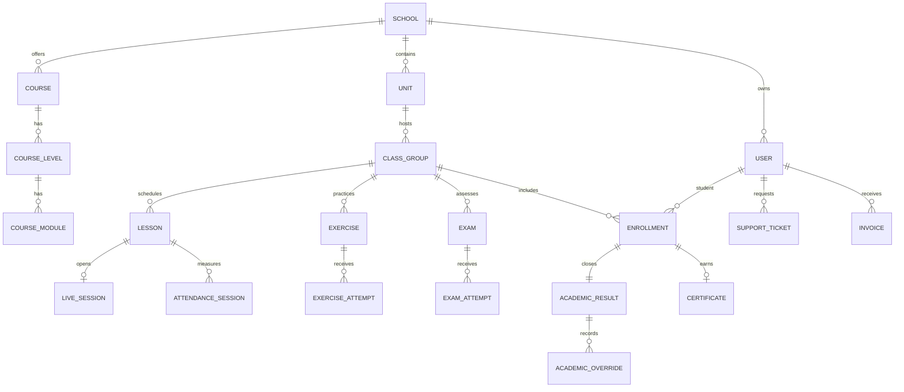

# Domain Model

FluentHub partitions entities by business responsibility.

- **Identity:** School, SchoolBranding, User, Role, Permission, UserSession.
- **Academic Structure:** Unit, Course, CourseLevel, CourseModule, ClassGroup, Enrollment.
- **Learning:** Lesson, LessonMaterial, LiveSession, LessonRecording, AttendanceSession, PresenceSegment, RecordingView.
- **Assessment:** separate Exercise and Exam aggregates, attempts, answers, grades, rubrics, skills and revisions.
- **Operations:** Invoice, Payment, Notification, SupportTicket, Assignment, Message and Attachment.
- **Certification:** AcademicPolicy, AcademicResult, AcademicOverride and Certificate.

Most principal entities carry `school_id`. Historical academic records avoid cascading deletion. Files carry metadata and opaque storage keys, while binary payloads remain in object storage.
